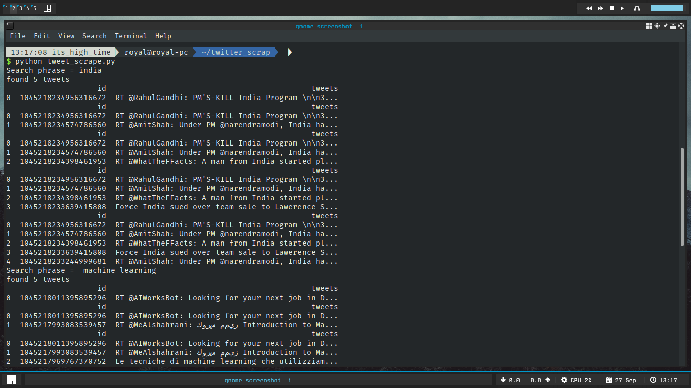
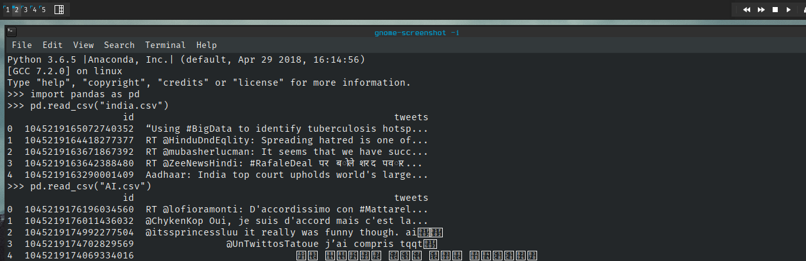

# Twitter Scrapper

## Overview

* I am using the twitter api to scarpe the tweets of a particular word

* First I created a twitter application and obtained the credentials required for accessing the API then created a words.txt file with random words to serve  queries for searching

* the tweet_scrape.py searches the tweets and json_parse.py converts the json to csv with required columns

## Working

* get_search_query method parses the words.txt file and passes those queries to tweet_search method which takes in
  the takes in the query to search and the max no. of searches as its parameters( *max_search can be changed by the user (I set it to 5))

*  write_tweets method writes the tweets in separate txt files

*  write_json_tweets is called by tweet_scrape from the json_parse.py which passes the id and tweets and id to write_to_csv   method in json_parse.py

## Screenshots:

